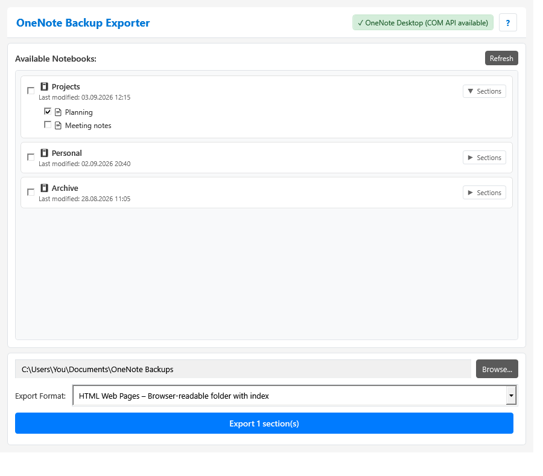
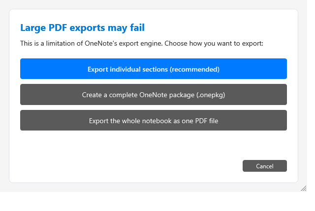

<div align="center">


# OneNote Backup Exporter

A Windows desktop application for exporting complete OneNote notebooks or selected sections
to backup and offline-reading formats. It communicates directly with OneNote Desktop through
Microsoft's COM API.


</div>

<p align="center">
  
</p>

## Download

[Download the latest Windows x64 installer](https://github.com/jli-software/OneNoteBackupExporter/releases/latest/download/OneNoteBackupExporter_Setup.exe)
or view the [latest release](../../releases/latest).

The installer is self-contained, so users do not need to install the .NET runtime separately.
The application version and short build revision are available from the **?** button in the
header.

Published assets use stable names across releases:

- `OneNoteBackupExporter_Setup.exe`
- `OneNoteBackupExporter_Setup.exe.sha256`

## Highlights

- Export complete notebooks or expand a notebook and select individual sections.
- Create full-fidelity OneNote packages, browser-readable HTML, PDF, or XPS files.
- Preserve OneNote section-group structure when exporting sections or HTML pages.
- Copy an existing local OneNote backup folder when that option is available.
- Protect previous exports with staging files or directories until the new export succeeds.
- Recover once from supported temporary OneNote COM/RPC connection failures.
- Cancel cooperatively without closing or terminating OneNote Desktop.

## Requirements

- Windows 10 or Windows 11, 64-bit
- OneNote Desktop with the COM API available, such as the desktop app included with
  Microsoft 365 or a supported Office installation

The retired **OneNote for Windows 10** UWP app does not expose the required COM API and is not
supported. Open OneNote Desktop at least once before using the exporter.

## Quick start

1. Open OneNote Desktop, allow cloud notebooks to finish syncing, and unlock any protected
   sections you want to export.
2. Start OneNote Backup Exporter. The header should report
   **OneNote Desktop (COM API available)**.
3. Select one or more notebooks. To export specific sections instead, choose **Sections** on a
   notebook and select the required sections.
4. Choose a destination folder and export format.
5. Select **Export** and keep OneNote open until the result is shown.

Exports can take several minutes for large or cloud-hosted notebooks. Progress messages indicate
which notebook, section, or HTML page is currently being processed.

## Export formats

| Format | Selection | Result and intended use |
|---|---|---|
| OneNote Package (`.onepkg`) | Notebook or section | Recommended backup format. Preserves OneNote content and can be imported into OneNote. |
| HTML Web Pages | Notebook or section | Offline browser copy with generated notebook and section indexes, individual `.htm` pages, and companion assets. |
| PDF Document (`.pdf`) | Notebook or section | Widely readable rendered output. For large notebooks, section-by-section export is safer. |
| XPS Document (`.xps`) | Notebook or section | Rendered output with good layout preservation. For large notebooks, section-by-section export is safer. |
| Local Backup Copy | All notebooks | Copies the complete local OneNote backup directory. Manual notebook selections are ignored. |

### HTML output

HTML exports create a `<Notebook>__<stable-id>_html` directory containing an `index.html` start
page. Each OneNote page is published separately because OneNote's COM API provides reliable HTML
publishing at page level.

- Complete notebook exports link to all exported pages from generated notebook and section
  indexes.
- Selected-section exports create or refresh the notebook index with the section indexes that
  are present in the destination.
- Section groups remain nested directories.
- Images and other companion assets written by OneNote are kept beside the exported pages.
- Stable IDs prevent same-named notebooks, sections, and pages from overwriting one another.
- Re-exporting replaces the previous HTML directory only after every page and index succeeds.

HTML is designed for offline reading. It is not a re-importable substitute for `.onepkg`.
OneNote subpage levels are currently listed as normal pages in the generated indexes.

### Large PDF and XPS exports

OneNote does not expose notebook size through its COM interface, and its renderer can fail on
large whole-notebook PDF or XPS exports. Before such an export, the application offers three
choices:

1. export every unlocked section separately (recommended);
2. create a complete `.onepkg` backup instead; or
3. attempt the whole-notebook rendered export.

<p align="center">
  
</p>

Section-by-section output preserves section groups as folders and uses collision-safe names.

### Local backup copy

This option copies all files from OneNote's local backup directory and ignores notebook
selection. Version 1.3 currently checks the German OneNote 16.0 backup path:

`%LOCALAPPDATA%\Microsoft\OneNote\16.0\Sicherung`

The option is disabled when that directory does not exist, cannot be read, or is empty.

## Reliability and cancellation

- OneNote COM work runs serially on a dedicated STA thread.
- Single-file and HTML exports are written to protected staging locations. An existing good
  export is replaced only after the new result is complete.
- Temporary supported COM/RPC failures receive one bounded reconnection and retry attempt.
- **Cancel** never closes or terminates OneNote. A synchronous OneNote `Publish` call cannot be
  interrupted safely; cancellation takes effect as soon as OneNote returns control.

## Known limitations

- Password-protected sections must be unlocked in OneNote before export.
- OneDrive and SharePoint notebooks must be fully synced before export.
- Export fidelity and supported page content are ultimately determined by OneNote's own
  publishing engine.
- Large whole-notebook PDF/XPS exports can still fail inside OneNote; use the recommended
  section-by-section mode or `.onepkg`.
- HTML indexes currently flatten OneNote subpage levels.
- The local backup-copy option currently uses the German `Sicherung` directory shown above.

## Verify a download

Download the matching
[SHA-256 checksum](https://github.com/jli-software/OneNoteBackupExporter/releases/latest/download/OneNoteBackupExporter_Setup.exe.sha256)
and verify the installer in PowerShell:

```powershell
Get-FileHash .\OneNoteBackupExporter_Setup.exe -Algorithm SHA256
Get-Content .\OneNoteBackupExporter_Setup.exe.sha256
```

The two hashes should match.

## Build from source

The project requires the .NET 10 SDK on Windows. Inno Setup is optional unless an installer is
needed.

```powershell
dotnet test .\tests\OneNoteExporter.Tests\OneNoteExporter.Tests.csproj -c Release
dotnet publish .\OneNoteExporter.csproj -c Release -r win-x64 --self-contained true
```

Run `build.ps1` to create the self-contained application in `build` and, when Inno Setup is
installed, `artifacts\OneNoteBackupExporter_Setup.exe`.

## Automated builds and releases

GitHub Actions runs the tests, publishes the self-contained Windows x64 application, and compiles
the installer for every pull request and every push to `main`. The installer and SHA-256 checksum
remain available as workflow artifacts for 14 days.

Pushing a semantic-version tag such as `vX.Y.Z` publishes a GitHub release when the tag version
matches `<Version>` in `OneNoteExporter.csproj`. The release contains the installer and checksum.

See [CHANGELOG.md](CHANGELOG.md) for version history.
